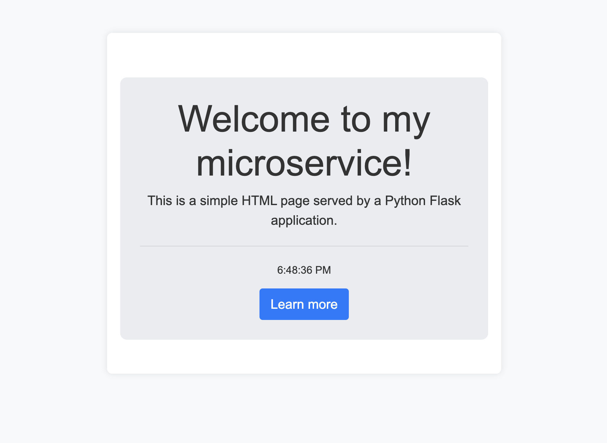
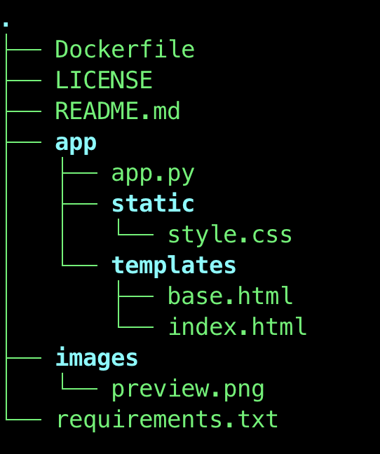

Простой микросервис на Python с использованием Flask, упакованный в Docker. Он обслуживает базовую HTML-страницу и идеально подходит для обучения или использования в качестве основы для более сложных приложений.

Особенности:

	•	🐍 Python и Flask
	•	🐋 Упаковка в Docker для удобного развертывания
	•	🌐 Готов к запуску локально или в облаке

🛠️ My Microservice

A simple, Dockerized microservice built with Python and Flask. It serves a basic HTML page and is perfect for learning or as a foundation for more complex applications.

Features:

	•	🐍 Python & Flask
	•	🐋 Dockerized for easy deployment
	•	🌐 Ready to run locally or in the cloud

Get Started:
Clone, build, and run the microservice in minutes.

